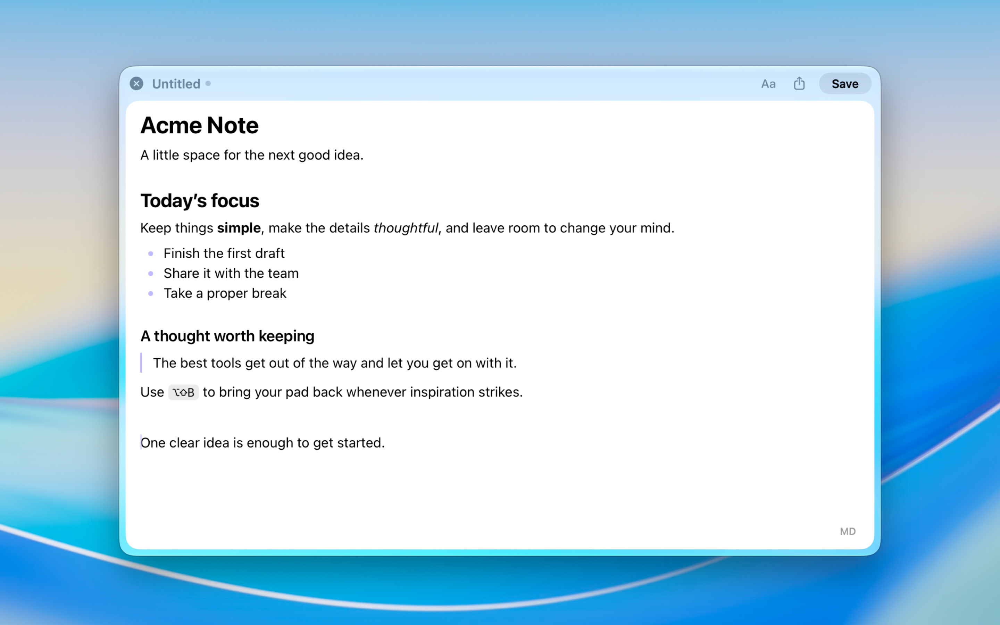

# PadPad

A lightweight text and Markdown editor for macOS. Open it with a keyboard shortcut, write or edit a file, then return to your work.

## Install

Requires macOS 27 or later. The beta is available to invited testers through TestFlight. A public App Store release is planned.

## Make yourself at home

- Write in a compact, translucent window that stays close at hand.
- Edit formatted Markdown with bold, italic, headings, lists, links, quotes and code, or work in plain text.
- Open, rename, save, and share `.txt` and `.md` files.
- Keep temporary drafts or save automatically, with configurable filenames.
- Return to a draft within your chosen time away, or start a fresh draft. Unsaved drafts expire after that interval unless saved.
- Customize shortcuts, accent color, and Dock and menu bar visibility.

The first deliberate opening introduces PadPad and lets you practice your configured global shortcut. Choose Next, try the shortcut, then press Return or choose Done to open a small editable Markdown draft. Done stays disabled until the shortcut responds; you can repeat practice or use the arrow keys to move between the two pages. You can skip the introduction, or replay it from Settings → About → Reset onboarding without replacing your current document. Launching the app, including at login, keeps the editor hidden.

Copy All Contents (⇧⌘C) copies the whole document without changing your selection. Markdown copies as readable text with formatting for apps that accept it; Copy as Markdown in the Edit menu copies the source. Existing custom shortcut assignments take precedence.

Aa beside Share reveals formatting in the center of the top toolbar. H before Bold offers headings 1–3; selecting the active heading restores body text. Formatting starts hidden each session, and narrow windows keep additional actions in an overflow menu.

Showing and hiding PadPad retains edits to saved files. With Save automatically off, use Save to write those edits; New, Open and Quit offer Save Changes, Discard Changes or Cancel before leaving an edited file. Draft lifetime applies only to temporary drafts, not saved files.

Settings → Files → Format → Show format switch controls whether the MD/TXT button appears. Hiding it preserves the document’s format and contents. The button switches the current draft between formatted Markdown and plain-text source, retaining line breaks. For an existing file, it offers Save As with the new extension and keeps the original file.

## A few shortcuts

| Shortcut | Action |
| --- | --- |
| ⇧⌥B | Show or hide PadPad from any app |
| ⌘N | New draft |
| ⌘O | Open a file |
| ⌘S | Save |
| ⇧⌘S | Save As |
| ⌘, | Settings |

## License

[MIT](LICENSE). Development guidance is in [AGENTS.md](AGENTS.md); distribution instructions are in [RELEASING.md](RELEASING.md).
